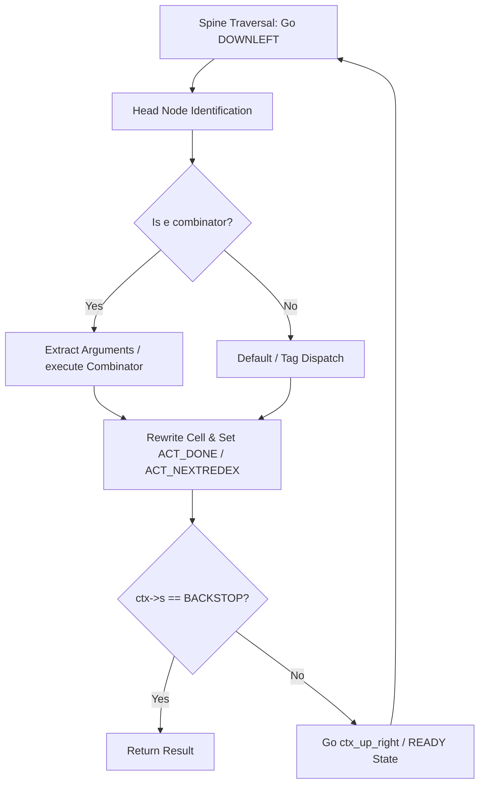

# Miranda Graph Reducer Architecture & Zig Migration Guide

This document explains the architecture of the Miranda graph reduction engine (originally in `reduce.c`, now refactored into modular C units) and details the execution model, pointer-reversing traversal engine, and garbage collection constraints to assist with the incremental migration to Zig.

---

## 1. Reducer State Variables & Context

The reduction machine is stateful, utilizing a centralized `ReductionCtx` context structure (defined in [reduce_internal.h](file:///Users/pkreyenhop/src/Miracula/reduce_internal.h)) rather than independent local stack variables. This context matches the planned Zig structure:

### C Context Structure
```c
typedef struct {
    word e;
    word s;
    word hold;
    word args[4];
    ReduceAction action;
} ReductionCtx;
```

### Zig Target Equivalent
```zig
const ReductionCtx = struct {
    e: Word,
    s: Word,
    hold: Word,
    args: [4]Word,
    action: ReduceAction,
};
```

### Registers Roles
* **`e` (Expression Register)**: The active expression pointer. At the start of a reduction cycle, it points to the head of the current redex. During traversal, it points to the cell currently being evaluated.
* **`s` (Spine Stack Register)**: Represents the top of the stack of traversed application (`AP`) cells. In this stackless reducer, `s` is the head pointer of the pointer-reversed path back to the root of the expression.
* **`hold` (Temporary Register)**: A scratch pointer used during node traversal transitions, cell allocations, and rewriting to temporarily hold references.
* **`args[4]` (Argument Cache)**: Cache registers (aliased as `arg1`, `arg2`, `arg3`, `arg4`) used to store arguments extracted from the spine during combinator execution.

---

## 2. Traversal Model & Pointer Reversal

The Miranda reducer uses a **pointer-reversing, stackless graph traversal** algorithm (also known as the Deutsch-Schorr-Waite algorithm). It eliminates stack overflow risks by reversing pointers in-place inside the application cells on the heap during traversal, then restoring them when returning up the spine.

### Traversal Operations
Traversal functions are implemented as `static inline` functions in [reduce_internal.h](file:///Users/pkreyenhop/src/Miracula/reduce_internal.h):

1. **`ctx_down_left(ReductionCtx *ctx)`** (formerly `DOWNLEFT`):
   * Walks down the left branch of an application cell (`AP`).
   * Reverses the cell's `hd` pointer to point back to the parent cell in the spine.
   * *Mutates*: `ctx->s` becomes the current cell, `ctx->e` becomes the head of the cell, and the cell's `hd` is updated to point to the parent.

2. **`ctx_up_left(ReductionCtx *ctx)`** (formerly `UPLEFT`):
   * Walks back up a left branch, restoring the reversed `hd` pointer of the application cell.
   * *Mutates*: `ctx->e` becomes the restored cell, and `ctx->s` becomes the grandparent.

3. **`ctx_down_right(ReductionCtx *ctx)`** (formerly `DOWNRIGHT`):
   * Traverses down the right branch of an application cell (typically for strict operators or constructors).
   * Reverses the cell's `tl` pointer and sets `tlptrbit` to indicate a right-branch traversal.
   * *Mutates*: `ctx->s` becomes the current cell (with `tlptrbit` set), and `ctx->e` becomes the tail.

4. **`ctx_up_right(ReductionCtx *ctx)`** (formerly `UPRIGHT`):
   * Walks back up a right branch, restoring the reversed `tl` pointer and clearing `tlptrbit`.
   * *Mutates*: `ctx->e` becomes the restored cell, and `ctx->s` becomes the grandparent.

---

## 3. The Reduction Cycle

A complete reduction cycle (hnf evaluation) consists of four distinct phases:



1. **Spine Traversal**: The reducer continuously executes `ctx_down_left` to walk down the left branch of application cells until it hits a non-`AP` cell or abnormal node.
2. **Head Node Dispatch**: The reducer inspects the head node `e` using a `switch` statement:
   * **Combinators**: Executes combinators (e.g., `S`, `K`, `I`, `B`, `C`, `Y`, `MAP`, `COND`).
   * **Strict Functions**: Forces reduction of arguments before execution.
3. **Execution & Rewriting**: The combinator rewrites the redex cell in-place. If the reduction is complete, it transitions via `ACT_DONE`. If it requires further reduction, it loops via `ACT_NEXTREDEX`.
4. **Ready State Handling**: If a subtask completes, `ctx_up_right` walks up the spine. If the tag is not `AP`, control passes to `handle_ready_state()` which performs operator evaluation and stack unwinding.

---

## 4. Garbage Collection Boundaries

The Miranda runtime uses a **conservative mark-and-sweep garbage collector** implemented in [data.zig](file:///Users/pkreyenhop/src/Miracula/data.zig#L479).

### Allocation APIs triggering GC
Any call to the following allocator APIs may trigger a garbage collection (`gc()`) if the heap runs out of free cells:
* `make(tag, x, y)`
* `ap(x, y)` (allocates an `AP` cell)
* `cons(x, y)` (allocates a `CONS` cell)
* `datapair(x, y)` (allocates a `DATAPAIR` cell)
* `rewrite_to_value()` / `rewrite_to_nil()` / `rewrite_to_cons()` (overwrites tags/pointers)

### GC Root Safety
The garbage collector identifies roots by scanning the C stack conservatively from the current address of the GC execution frame up to the stack base pointer `cstack` (captured when starting the reducer in `output()`).
* **Safe**: Since `ReductionCtx` is a local variable on the stack, all of its active fields (`e`, `s`, `hold`, and `args[]`) reside on the C stack and are scanned automatically.
* **Warning**: Never store heap references in global static variables or fields outside the stack context without registering them in the `bases()` function in `data.zig`.
