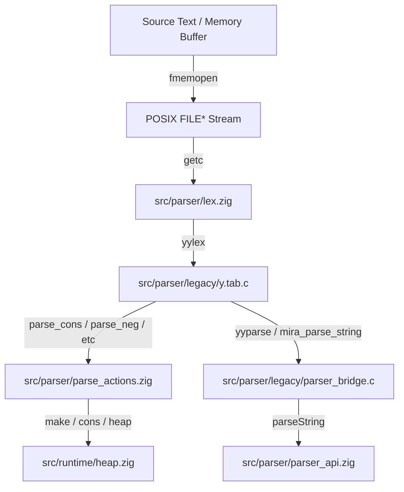

# Miranda Parser Dependency Audit

This document maps all internal and external dependencies of the Miranda parser subsystem, tracing connections between C parser components, Zig modules, and runtime structures.

## 1. Architectural Flow

The parser operates as a hybrid bridge subsystem. Lexical analysis is implemented in Zig, syntax parsing is conducted by the legacy C Bison parser, and AST node construction is delegated to Zig-based action shims.

---

## 2. Component Mapping

| Subsystem Component | Language | Location | Primary Responsibilities |
|---|---|---|---|
| **Parser API** | Zig | `src/parser/parser_api.zig` | Public wrapper interface, exports parse controls to main runtime. |
| **C Bridge** | C | `src/parser/legacy/parser_bridge.c` | Controls Bison execution, sets up memory stream buffers, isolates `yyerror`. |
| **Parser Engine**| C | `src/parser/legacy/y.tab.c` | Generated LALR state machine that implements yacc grammar rules. |
| **Lexical Analyzer**| Zig | `src/parser/lex.zig` | Extracts tokens, handles layout-sensitive offside rules, and tracks indentation stacks. |
| **Parse Actions** | Zig | `src/parser/parse_actions.zig` | Constructs AST nodes (tuples, lists, functions, application cells) in the heap. |

---

## 3. Dependency Catalog

### 3.1. External C (Libc) Dependencies
The parser interacts with the OS file system and memory streams through standard POSIX facilities:
- **`fmemopen`**: Opens a raw memory string as a stream. Decouples parsing from standard file input translations.
- **`fclose`**: Closes streams created by `fmemopen` and `fopen`.
- **`getc` / `ungetc`**: Core stream character reading used by the lexer.
- **`fgets` / `fputs` / `putchar`**: Handles literate script echo modes and directive logs.

### 3.2. Internal Zig Runtime Dependencies
- **`src/runtime/heap.zig`**:
  - `make(tag, x, y)`: Allocates nodes in the shared heap for AST construction.
  - `cons(x, y)`: Allocates list nodes.
  - `mark(x)`: Traverses roots to mark active cells during GC sweeps.
- **`src/parser/parse_actions.zig`**:
  - Exports functions like `parse_cons`, `parse_nil`, `parse_infix` to C. These map C yacc reduction variables into standard Miranda AST heap nodes.
